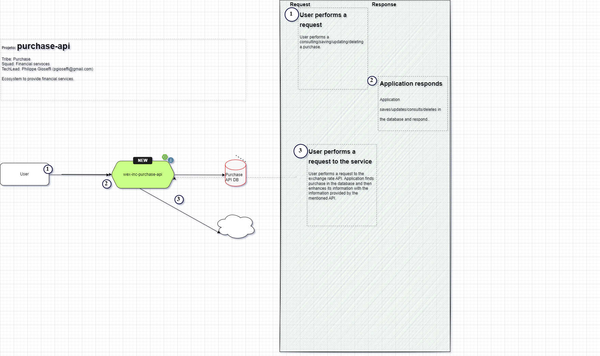

# Wex Inc Purchase API Test
This is API has been developed to recruitment purposes in the Wex Inc company.

## Dependencies

- [Java 17 (Programming language)](https://docs.oracle.com/en/java/javase/17/docs/api/index.html)
- [Spring (Framework web)](https://docs.spring.io/spring-framework/docs/current/reference/html/)
- [Tomcat (Web server)](https://tomcat.apache.org/)
- [Maven (Build tool)](https://maven.apache.org/guides/index.html)
- [Consul](https://www.consul.io/)

## Architecture
This project uses clean architecture and is divided into three Maven modules:
- Core: This module contains all the business rules of the application;
- Infrastructure: This module is responsible to persist purchases in the database and consume the Exchange Rate API webservice;
- Presentation: This module is the entrypoint of the application and exposes our services.

## Technical Flow

## Integrations
##### Consul
Spring Cloud Consul integration in order to read configurable application data.

## Swagger
- [http://localhost:8080/](http://localhost:8080/)

## Project build
Please run Maven command `mvn clean package`.
Please refer to [Application Running](#application-running) section because building this application requires Consul to be started.

## Test Coverage
Please run Maven command `mvn clean verify`

## Unit and Integration Tests
Please run Maven command `mvn test`

## Application Running
1. [Download Consul](https://developer.hashicorp.com/consul/install) by choosing the best option to your environment;
2. Unzip and place it in a directory listed in your environment variables;
3. Execute Consul via prompt command by typing `consul agent -dev`. Make sure to navigate to the folder you downloaded Consul and that this directory is in your OS environment variables;
4. Start another prompt command;
5. In the prompt command, go to `docs\consul` folder;
6. Run the command `consul kv import @import_consul_key_and_values_wexinc_test.json`
7. Start a third prompt command;
8. Navigate to the root of the project and then to `presentation` folder;
9. Please run Maven command `mvn spring-boot:run`

## Database
This application was built using H2 Database. If you want to debug the database please access [http://localhost:8080/h2-console/](http://localhost:8080/h2-console/). To discover admin and password please access [http://localhost:8500/ui/dc1/kv/wexinc/purchase-api/](http://localhost:8500/ui/dc1/kv/wexinc/purchase-api/) and refer to `spring.datasource.username` and `spring.datasource.password` properties.

## Testing
- The `docs/postman` folder contains a Postman collection in order to test the application endpoints.

## Important notes
- The whole project is documented. Plase refer to `<module>/target/apidocs` folder;
- The whole project is tested. Plase refer to `<module>/site/jacoco` folder;